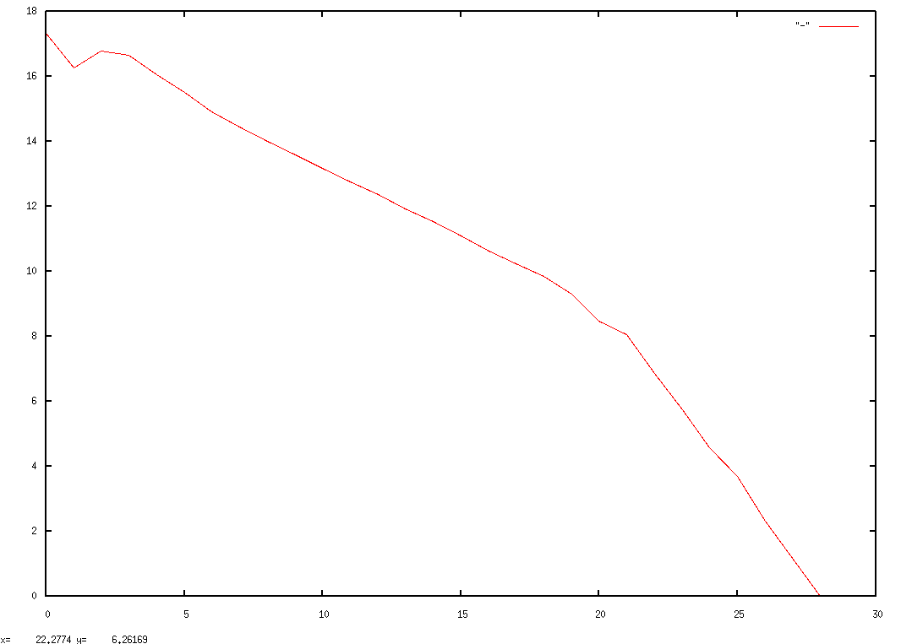
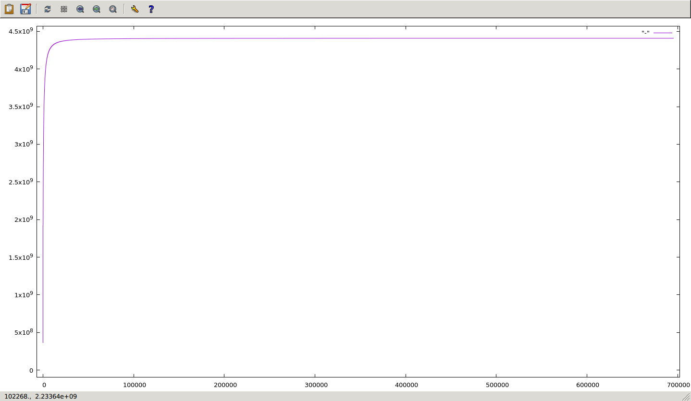

# Aggregate look at users/subreddits
There are two parts to this analysis. First, we want a general look at the state
of reddit at large: user/domain/etc trends, breakdown of up/downvotes by
user+subreddit, etc.

Second, we want to get a sense for which users and subreddits make up the bulk
of reddit as a whole. There's a lot of data that we can't use for various
reasons:

- Unidentifiable users (we see them as `[deleted]`)
- Users that haven't made enough comments to be meaningful
- Subreddits that don't have enough comments to be meaningful

(**NB:** we can actually use `[deleted]` data in some cases: we may be able to
deanonymize users by looking at historical activity.)

This aggregate export should give us enough to identify relevant
users/subreddits for future steps.

## First export: author+subreddit+date by year, with metadata
We'll access this dataset several times, so let's generate it once in LZ4. I'm
doing two exports, one for comments and one for submissions; here are the fields
for each:

- Comments
    - Author
    - Subreddit
    - Date
    - Comment ID
    - Parent ID
    - Score
    - Controversiality
- Submissions
    - Author
    - Subreddit
    - Date
    - Post ID
    - Domain
    - Upvotes
    - Downvotes

```sh
$ mkdir -p agg-comments agg-submissions

$ ni reddit-comments r/\\/20/ F:/fB \
     e[ xargs -P24 -I{} \
        ni reddit-comments/{} \
           D:author,:subreddit,:created_utc,:link_id,:parent_id,:score,:controversiality \
           rABC z4\>agg-comments/{} ] \
  | cat

$ ni reddit-submissions r/\\/20/ F:/fB \
     e[ xargs -P24 -I{} \
        ni reddit-submissions/{} \
           D:author,:subreddit,:created_utc,:name,:domain,:ups,:downs rABC \
           z4\>agg-submissions/{} ] \
  | cat
```

## User/subreddit counts
Now let's count up activity by user and subreddit. I'm keeping comments and
posts separate because disrepancies between the two might tell us something
interesting.

(**NB:** I could use the same query structure for all of these, but there are
few enough subreddits that it's worth bulk-sorting the counts to get some
parallelism.)

```sh
$ ni agg-comments    \<fA Uxz\>agg-usercomments
$ ni agg-submissions \<fA Uxz\>agg-userposts
$ ni agg-submissions \<S12[fB Ux] g,sgA z\>agg-subposts
$ ni agg-comments    \<S12[fB Ux] g,sgA z\>agg-subcomments
```

I plan to do some matrix operations on both users and subs, so we'll have memory
limitations to consider (I assume three copies of whichever matrix we're
operating on):

```sh
$ units -t 'sqrt(144GB / 8B / 3)'
77459.667                               # hard limit on matrix dimensions
```

### Most-common subreddits
Here's the distribution of subreddits by #comments, log2-scaled on both axes:

```sh
$ ni agg-subcomments fB,l2qoc,l2x | nfu -p %l
```



A better way to look at it is as a traffic accumulation:

```sh
$ ni agg-subcomments fB O,s | nfu -p %l
```



Let's break it out in terms of percentage of total traffic:

```sh
$ ni agg-subcomments fB O,sr+1
4408877755                              # total comments
$ ni agg-subcomments fB O,sp'r a/4408877755, $.' ,q.05p'r a, b, () = rea'
0.1     1
0.15    4
0.2     8
0.25    14
0.3     22
0.35    35
0.4     54
0.45    81
0.5     119
0.55    172
0.6     244
0.65    343
0.7     473
0.75    652
0.8     926
0.85    1349
0.9     2059
0.95    3528
1       9402
```

...so we can get about 97.5% of comments with 9402 subreddits. Let's say we want
99%:

```sh
$ ni agg-subcomments fB O,s Wn rp'b/4408877755 >= 0.99' r1
19403   4364789093
```

Awesome, 19403. That's a manageable number. Let's build that list so we can
filter stuff later on:

```sh
$ ni agg-subcomments OBfAr19403 >relevant-subs
```

### Users
Before I kick this off, let's do some rough math for "human-reasonable" numbers.
I need to be careful about how I put this together because trolls might behave
like bots, but we want those.

OK, let's assume the most absolutely dedicated redditor spends 12 hours a day
online creating one comment per minute. This is a maximum of 720 comments per
day, which is an insane amount. Let's find each redditor's observable lifetime,
and to simplify this let's build a user index, sharded by user ID.

```sh
$ mkdir user-comments; \
  ni agg-comments \<S12[rp'a ne "[deleted]"' \
                        p'my $h = unpack(n => md5 a) >> 6;    # 1024 shards
                          r "/tmp/" . ($h >> 5),
                            sprintf("user-comments/%03x", $h), $_'] \
     S\>S\>z4
```

Lifetime calculation:

```sh
$ mkdir -p user-lifetimes; \
  ni user-comments F:/fB e[ xargs -P24 -I{} \
    ni user-comments/{} fAC \
       p'^{%max = %min = ()}
           $max{+a} = max $max{+a} // b, b;
           $min{+a} = min $min{+a} // b, b; ();
           END { r $_, $min{$_}, $max{$_} for keys %max }' \
       z4\>user-lifetimes/{} ] | cat

# quick histogram of rounded log2(#hours)
$ ni user-lifetimes \<S24[p'(c - b) / 3600' ,L2q] ocx
0       10177106                        # most users vanish quickly
1       861358
2       462323
3       369701
4       547915
5       613735
6       603718
7       706777
8       818043                          # ~10 days
9       1027436                         # ~21 days
10      1292798                         # ~43 days
11      1632648                         # ~85 days
12      2026148                         # ~6 months
13      2491248                         # ~1 year
14      2822514                         # ~2 years
15      2896593                         # ~32768 hours = ~4 years
16      1126096
17      10013
```

We need two subsets, one for "eigenusers" (stuff that fits into a matrix) and
one for "nontrivial users" (anyone who posts to more than one subreddit, more or
less).
