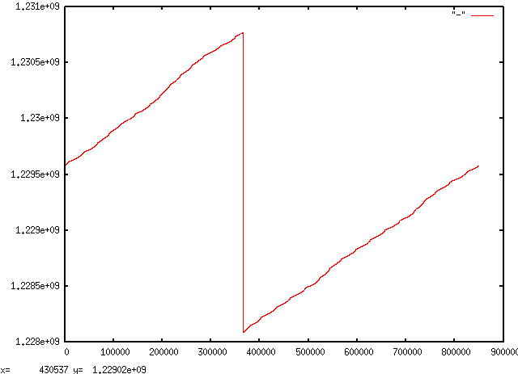

# Processing Reddit comments
You can download pretty much all of Reddit by assembling a few different
datasources, all of which ultimately come from
[PushShift](https://pushshift.io/).

- [A fairly complete torrent of
  comments](http://academictorrents.com/details/85a5bd50e4c365f8df70240ffd4ecc7dec59912b)
- [PushShift reddit files](https://files.pushshift.io/reddit/)

As datasets go, these are nearly perfect: the format is consistent, concise, and
self-explanatory. I want to do three things:

1. Split files by hour instead of month
2. Unify the compression to `xz -9e` (we're going to be IO-bound)
3. Convert from JSON to TSV

(3) is project-specific, so let's do (1) and (2) first.

## Time splitting
The monthly files are _almost_ sorted by time:

```sh
$ ni RC_2018-06.xz D:created_utc ,d c
1       1527811200
40      0
1       1
1       -1          # time moves backwards
1       1
48      0
1       1
34      0
1       1
46      0
1       1
1       -1          # same here
1       1
47      0
...
```

These skips are minimal, so I'll coerce timestamps into ascending order rather
than fully sorting everything. This will introduce a few seconds of inaccuracy
for about 1% of the data.

**Update:** some time skips are a lot worse:

```sh
$ ni RC_2008-12.lz4 D:created_utc | nfu -p %l
```



This means we need to allow large backward skips.

Let's format the filenames in a way that's easy to match with wildcards:
`yyyy.mmdd.hh.xz`:

```sh
$ ni RC_2018-06.xz D:created_utc \
     p'r sprintf "%04d.%02d%02d.%02d.xz", tep YmdH => a' c

154939  2018.0601.00.xz
170311  2018.0601.01.xz
174762  2018.0601.02.xz
175671  2018.0601.03.xz
150038  2018.0601.04.xz
120449  2018.0601.05.xz
98766   2018.0601.06.xz
85675   2018.0601.07.xz
79248   2018.0601.08.xz
76778   2018.0601.09.xz
86117   2018.0601.10.xz
106030  2018.0601.11.xz
1       2018.0601.12.xz                 # time skip; we'll fix this below
1       2018.0601.11.xz
130088  2018.0601.12.xz
153899  2018.0601.13.xz
174861  2018.0601.14.xz
...
```

Fixing the time skip is simple; we just need to keep a variable that stores the
current time and clip to that:

```sh
$ ni RC_2018-06.xz D:created_utc \
     p'r sprintf "%04d.%02d%02d.%02d.xz", tep YmdH => ($t = max $t // 0, a)' c

154939  2018.0601.00.xz
170311  2018.0601.01.xz
174762  2018.0601.02.xz
175671  2018.0601.03.xz
150038  2018.0601.04.xz
120449  2018.0601.05.xz
98766   2018.0601.06.xz
85675   2018.0601.07.xz
79248   2018.0601.08.xz
76778   2018.0601.09.xz
86117   2018.0601.10.xz
106030  2018.0601.11.xz
130090  2018.0601.12.xz                 # strays placed into this hour
153899  2018.0601.13.xz
174861  2018.0601.14.xz
...
```

**Quick sanity check:** do we get an unmanageable number of files from this?

```sh
$ units -t 13years hours
113955.57
```

It's a lot, but not too many to manage easily with `xargs`. We'd only be in
trouble if we were using Hadoop.

Now we can produce hourlies. We can't use `D` because it consumes the JSON, but
we can write a simple regex to do the same thing:

```sh
$ ni RC_2018-06.xz \
     p'my ($utc) = /"created_utc":"?(\d+)"?/;
       r sprintf("%04d.%02d%02d.%02d.xz",
                 tep YmdH => ($t = max $t // 0, $utc)),
         a'

2018.0601.00.xz {"archived":false,"author":"[deleted]","author_flair_background_color":"","author_flair_css_class":null,"author_flair_template_id":null,"author_flair_text":null,"author_flair_text_color":"dark","body":"[deleted]","can_gild":true,"can_mod_post":false,"controversiality":0,"created_utc":1527811200,"distinguished":null,"edited":false,"gilded":0,"id":"dzwso8y","is_submitter":false,"link_id":"t3_8njnh5","no_follow":true,"parent_id":"t3_8njnh5","permalink":"\/r\/pics\/comments\/8njnh5\/this_is_one_sexy_axe\/dzwso8y\/","removal_reason":null,"retrieved_on":1532065421,"rte_mode":"markdown","score":1,"score_hidden":false,"send_replies":true,"stickied":false,"subreddit":"pics","subreddit_id":"t5_2qh0u","subreddit_type":"public"}
...
```

This looks good. Now let's parallelize on a bunch of xzips at a time, avoiding
things in adjacent months since there may be some rounding error. I have all of
the monthly filenames in a single file called `sources`.

```sh
$ ni sources rp'$.&1'
/mnt/v1/t9/data/reddit-comments-lz4//RC_2005-12.lz4
/mnt/v1/t9/data/reddit-comments-lz4//RC_2006-02.lz4
/mnt/v1/t9/data/reddit-comments-lz4//RC_2006-04.lz4
/mnt/v1/t9/data/reddit-comments-lz4//RC_2006-06.lz4
...
```

Looks great. These can be inputs to `xargs -P` (the final `| cat` tells `ni`
not to run a pager, which is important because `xargs` will wait for it
otherwise).

The final bit of processing I want to do is to normalize the field ordering
inside the JSON objects. This opens the door for some interesting optimizations
I'd like to research later on. The simplest way to do this transformation is to
just re-encode the JSON using `je(jd(a))`; ni always emits the keys in sorted
order. Re-encoding the JSONs doesn't significantly impact performance; it runs
at about 5MB/s, whereas `xz -9e` compresses at less than 1MB/s.

```sh
$ ni sources rp'$.&1' \
  | xargs -I{} -P24 \
    ni {} p'my ($utc) = /"created_utc":"?(\d+)"?/;
            $t = $utc if $utc + 1800 < $t;      # allow large backward skips
            r sprintf("%04d.%02d%02d.%02d.xz",
                      tep YmdH => ($t = max $t // 0, $utc)),
              je jd a' \
          W\>e[xz -9e] \
  | cat
```

## Accessing the data
We can avoid the overhead of starting new `xz` processes by concatenating the
compressed files up front; for example:

```sh
$ time cat 2008.* | xz -dc | wc -l
3723961

real    1m5.546s
user    0m46.260s
sys     0m5.396s
```

We can also parallelize decompression using `xargs` (ordinarily we'd do better,
but I'm running this concurrently with the ingestion step above):

```sh
$ time ls 2008.* | xargs -n16 -P12 xz -dc | wc -l
3723961

real    0m16.929s
user    0m47.720s
sys     0m4.888s
```
